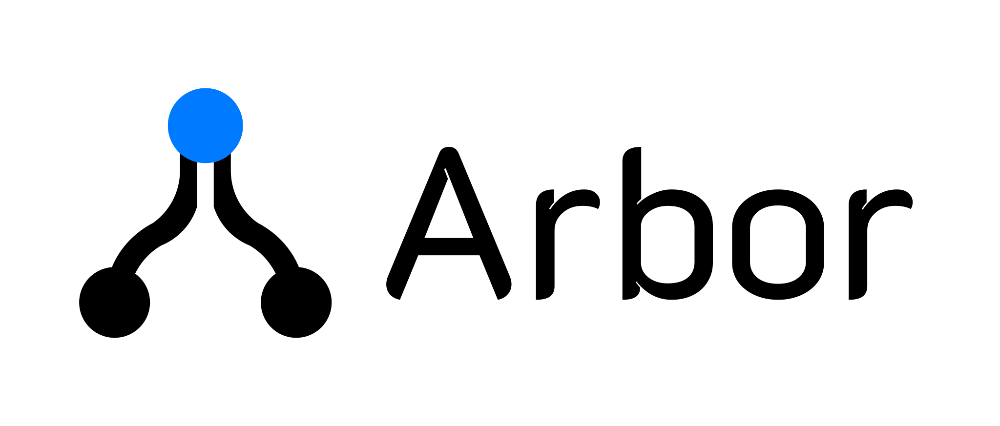

<p align="center">
  <picture>
    <source media="(prefers-color-scheme: dark)" srcset="assets/images/Arbor_Title_white.svg">
    
  </picture>
</p>

<p align="center">
  一款本地优先、以知识分支为核心的 AI 学习工具。
</p>

<p align="center">
  <a href="LICENSE">Apache-2.0 License</a> · React · TypeScript · Vite
</p>

## Arbor 是什么

传统聊天会把学习过程压缩成一条越来越长的消息流。Arbor 将 AI 回答拆成可点击的知识模块，让你从任意模块继续追问，并把不同探索方向保存为一棵清晰的对话树。

Arbor 当前是纯浏览器应用：对话、分支、模型服务配置和偏好设置保存在本地 IndexedDB 中；模型请求由浏览器直接发送到你配置的 Provider，不经过 Arbor 后端。

## 核心能力

- **Section 驱动的学习分支**：AI 使用原生 Markdown 回答，每个顶层 `##` 会成为可点击的知识模块。
- **树状对话**：可以从不同 Section 创建 sibling branch，在知识树中自由切换并保留完整路径。
- **精确的局部上下文**：从 Section 追问时，模型会优先在所选模块内理解“这个公式”“第三步”“上面”等指代；无法唯一判断时会先询问澄清。
- **无感自动续写**：命中输出长度限制后自动继续生成，并把多次请求合并为同一条连续回答；连续续写达到安全上限后才交由用户决定。
- **Markdown 与 LaTeX**：正常渲染 Markdown、GFM 和 KaTeX，不使用脆弱的 JSON 回答协议。
- **智能标题**：回答完成后，以短输出请求为 Conversation 和 Node 生成主题标题；支持手动重命名，且不会覆盖人工标题。
- **多 Provider 支持**：兼容 Anthropic Messages、OpenAI Responses 和 OpenAI-compatible Chat Completions。
- **中英文界面**：支持自动语言、简体中文和英文；不会翻译用户消息或 AI 内容。
- **本地数据管理**：支持导出单个对话或完整备份，数据格式带有 schema version。

## 快速开始

环境要求：Node.js 22 或更高版本、npm。

```bash
git clone https://github.com/AaronChou313/arbor.git
cd arbor
npm install
npm run dev
```

打开 Vite 输出的本地地址即可使用。

## 配置模型服务

进入 **设置 → 模型服务**，添加一个 Provider：

| 协议 | 典型端点 |
| --- | --- |
| Anthropic Messages | `/v1/messages` |
| OpenAI Responses | `/v1/responses` |
| Chat Completions | `/v1/chat/completions` |

填写名称、Base URL、API Key 和模型名称，先执行“测试连接”，保存后将其设为当前 Provider。

### Max output tokens

新 Provider 默认使用 **Auto**：

- OpenAI Responses 和 Chat Completions 不主动发送输出上限；
- 协议要求必须提供上限时，由 Adapter 使用内部兼容值；
- 只有手动填写数字时，才使用自定义限制。

Arbor 会记录 usage 和原始停止原因用于内部诊断，但不会把 `end_turn`、`stop_sequence` 等技术值直接显示给用户。

## 回答与分支规则

- 第一个 `##` 之前的内容视为回答引言；
- 每个顶层 `##` 是一个可点击 Section；
- `###` 及更低级标题属于当前 Section；
- 代码块中的 `##` 不会被误识别为 Section；
- 没有合法 `##` 时，会安全回退为普通 Markdown 回答；
- Section ID 由前端生成，不要求模型输出内部协议字段。

每个 Node 通过 `parentNodeId` 连接到父节点。Arbor 只将“根节点到当前节点”的路径发送给模型；如果子节点来自 Section Anchor，则下一轮上下文会明确标记所选 Section。数据结构同时预留了 `anchorQuote` 和 `anchorBlockId`，用于未来支持段落级和公式级锚点。

## 隐私与安全

Arbor 没有中转模型请求的后端服务。你的提示词和 API Key 会由当前浏览器直接发送到所配置的 Provider。

- API Key 默认只保存在当前浏览器会话中；
- 开启“在此设备上记住 API Key”后，密钥会写入本地 IndexedDB；
- 完整备份默认不包含密钥，只有显式勾选后才会导出；
- 浏览器存储并不是安全保险箱，请只在可信设备上保存密钥；
- Provider 必须允许来自当前站点的浏览器请求，否则可能需要可信的 CORS 网关。

请勿把真实 API Key 写入源码、日志、测试产物或提交到仓库。

## 开发与测试

```bash
npm run lint       # ESLint
npm run typecheck  # TypeScript
npm run test       # Vitest 单元测试
npm run test:e2e   # Playwright E2E
npm run build      # 生产构建
```

首次运行 E2E 时可能需要安装 Chromium：

```bash
npx playwright install chromium
```

### 可选的真实 Provider 测试

默认测试使用 Mock Provider，不需要联网或密钥。若要验证真实模型链路，请仅在本地环境变量或被忽略的 `*.local` 文件中设置：

```bash
export ARBOR_LIVE_PROTOCOL=anthropic
export ARBOR_LIVE_BASE_URL=https://provider.example.com
export ARBOR_LIVE_API_KEY=your-session-only-key
export ARBOR_LIVE_MODEL=your-model

npm run test:live
```

环境变量不完整时，Live Test 会自动跳过。真实测试不会把密钥或完整回答写入测试产物，并关闭 Playwright trace、截图和录像。

## 构建与部署

```bash
npm run build
npm run preview
```

项目使用 `HashRouter` 和相对 Vite 资源路径，可直接部署到 GitHub Pages 的仓库子路径。仓库内置的 GitHub Actions 工作流会在推送到 `main` 或 `master` 后构建和部署。

在 GitHub 仓库的 **Settings → Pages** 中选择 **GitHub Actions** 作为发布来源即可。

## 技术栈

- React 19
- TypeScript
- Vite
- Zustand
- IndexedDB / `idb`
- React Markdown、Remark GFM、KaTeX
- Vitest、Playwright

## 贡献

欢迎通过 Issue 或 Pull Request 提交问题、改进建议和代码贡献。提交前请至少运行：

```bash
npm run lint
npm run typecheck
npm run test
npm run build
```

## 开源许可

Arbor 使用 [Apache License 2.0](LICENSE) 开源。
